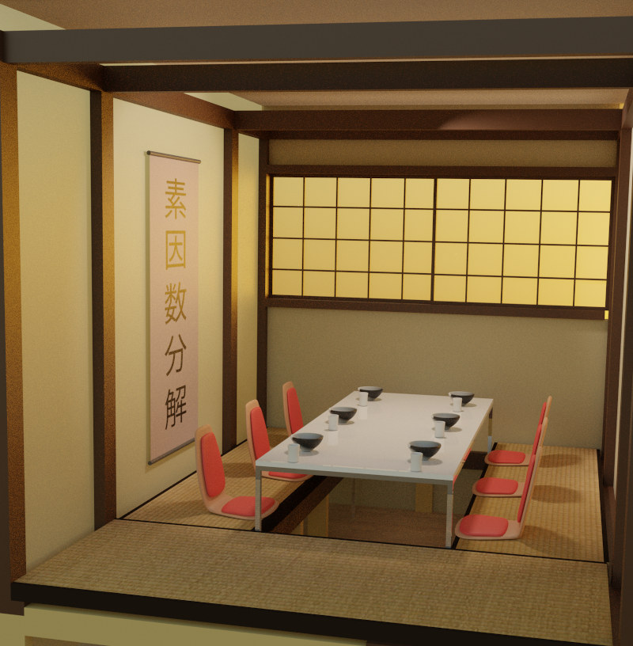

# Washitsu! 和室！
Ja! Gjett om!

What to do when Corona hinders travel to Japan? Build my own Japan at home :3

## Materials
- [Lekter 48x098 C24](https://www.maxbo.no/konstruksjonsvirke-gran-48x098-c24-p914628/ )
	- For the floor framework
	py 2*3 + 10*0.35 + 2.2 * 2 + 3 * 2 + 3 * 2
- [Sponplate gulv 22x620x1820](https://www.maxbo.no/sponplate-gulv-std-1820-22x620x1820-gulv-p6-std-p959990/ )
	- Tatami will be laid directly onto those
- [Gipsplater 1200x2400x12,5mm](https://www.maxbo.no/gipsplate-standard-1200x2400x12-5-norgips-p960331/ )
	- Walls where shouji paper will be glued to
- [Lekter 48x048](https://www.maxbo.no/justert-rekke-gran-furu-48x048-kl-1-p903981/ )
	- Should probably drop this one, replace with:
- [Glattkantlist furu 12x043x2400 ubehandlet](https://www.maxbo.no/glattkantlist-furu-12x043x2400-ubehandlet-p2779716/ )
	- For the walls
	- TODO need a wider version too that holds the windows?
- Mange vinkler til alt
- Shouji paper, lots!
	- Need to be somewhat transparent, we may layer them to adjust transparency?
